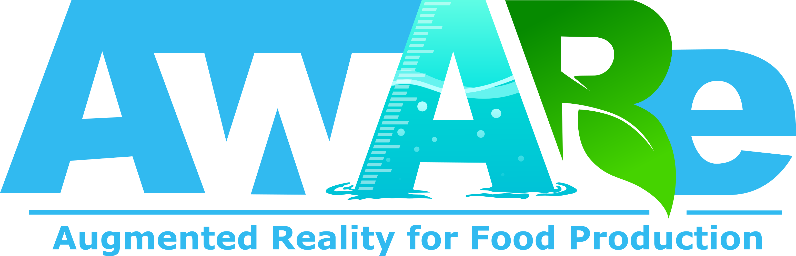

  

# AwARe: AR Food Production
Utrecht University: Computer Science BA Software Project 2023-2024

<!--

    

-->

## Table of Contents
- [Property](#prop)
- [Description](#descr)
- [Project Content](#project-content-)
- [Installation and Setup](#setup)
- [Documentation](#docs)
- [Acknowledgements](#ack)

(<a href="#toTop">back to top</a>)

## Property 
> All-rights reserved to...

(c) Copyright Utrecht University. (Department of Information and Computing Sciences)  
For any inquiries regarding the use or licensing of this product please contact [Utrecht University](https://www.uu.nl/en/organisation/contact).

(<a href="#toTop">back to top</a>)

## Description 
> What is AwARe?

AwARe is a mobile app designed to enhance awareness of the resources required for the production of ingredients through the means of augmented reality (AR). The main idea of this application is that users will become more aware of the impact that their food consumption has when the materials are visualized in their own environment, for example in their own kitchen. Researchers will be able to use this app to send questionnaires to users to study the behavioral changes of the users.

In this app, users can assemble a list of ingredients with specific quantities by searching through our database. These can be visualized in their own environment using augmented reality. Before doing this, users must scan their room. Scanned rooms can be reused by loading them back in, and synchronizing those using anchor points. After a room has been scanned, a path will be automatically generated inside of it, on which no resources will be placed.

(<a href="#toTop">back to top</a>)

## Project Content 
> Everything included in the project.

### First-party 
> Code and other content developed by us.
* [FirstParty](/AwARe/Assets/FirstParty) Code and other content developed by us. A detailed content overview is provided there.

### Third-party 
> External packages and tools in this repository.
* [AR Foundation](https://docs.unity3d.com/Packages/com.unity.xr.arfoundation@5.1/manual/index.html) Used for everything AR related.
* [Unity Test FrameWork](https://docs.unity3d.com/Packages/com.unity.test-framework@1.4/manual/index.html) Used for creating and running unit tests in unity.
* [CodeCoverage](https://docs.unity3d.com/Packages/com.unity.testtools.codecoverage@0.2/manual/index.html) Used for finding out which lines of code are covered/uncovered by our tests.
* [Mobile Notifications](https://docs.unity3d.com/Packages/com.unity.mobile.notifications@1.4/manual/index.html) Used for sending notifications.
* [Doxygen](https://www.doxygen.nl/) Used for generating documentation from the doc-comments in the codebase.
* [StyleCop](https://marketplace.visualstudio.com/items?itemName=ChrisDahlberg.StyleCop) Used for enforcing style and consistency rules.
* [Serialize Interfaces!](https://assetstore.unity.com/packages/tools/utilities/serialize-interfaces-187505) Used for Referencing and serializing Unity Objects with a specified interface.
* [Json.NET](https://www.newtonsoft.com/json) Used for serializing/deserializing json files/strings.
* [Rest Client for Unity](https://assetstore.unity.com/packages/tools/network/rest-client-for-unity-102501) Used for handling requests between the server and application.
* [RSG.Promise](https://www.nuget.org/packages/RSG.Promise) Used for multithreading/asynchronous operations.
* [Resharper](https://www.jetbrains.com/resharper/) Used for linting.
* [NuGetForUnity](https://github.com/GlitchEnzo/NuGetForUnity) Used for managing packages within Unity.

Unity does not support organizing folders of Build-in packages or Third Party Software well. In principal, everything in the Unity Project that is stored outside First-Party is not owned by us.

(<a href="#toTop">back to top</a>)

## Installation and Setup 
> Installation and use of this product.

### Mobile 
The latest mobile builds for Android and IOS can be found here:
[Mobile Download](https://drive.google.com/drive/folders/1m9vdsbXeIhjuoOwdXRdQ0jMPpz5yU6HC)

### Unity 
For development, we use unity editor version 2022.3.13f1. We recommend you to use this version too. This editor can be downloaded from [Unity Hub](https://unity.com/download).
These steps can be used to add the project to Unity:

1.  Clone the repository using your favorite git tool.
2.  Open Unity Hub.
3.  Press "Add" under the projects tab.
4.  Select the AwARe folder inside the cloned repository.

To run the application in the Unity editor, make sure that the appscenes "Home", "ARSupport" and "GeneralSupport" are active in the hierarchy. These scenes are located [here](/AwARe/Assets/FirstParty/Application/Scenes).

### Server 
For developing and testing we run the server locally. We also have access to a remote server from the UU, which runs on Ubuntu. On the remote server we have installed the main branch of our Github repository. Connecting to the server and running commands is done via SSH. On Windows we use the PuTTY SSH client. On mac we use the built in ssh commands. To upload/download files to/from the server we use the SSH File Transfer Protocol (the “sftp” command) and FileZilla.

See [Server](/Server) for detailed server setup instructions.

(<a href="#toTop">back to top</a>)

## Documentation 
> Further reading.
* [Epic documentation](https://drive.google.com/drive/folders/1qO1r8snl1aWU3m20tUas474e7qjv23iI?usp=drive_link) Documentation per major feature.
* [Doxygen documentation](/Docs/Doxygen) Documentation from comments present in code.

(<a href="#toTop">back to top</a>)

## Acknowledgements 
> The disclaimers and references.

### Unity Framework 
* [Unity](https://unity.com/)

### Third-party Software 
* [Doxygen](https://www.doxygen.nl/) By Dimitri van Heesch.
* [CodeCoverage](https://docs.unity3d.com/Packages/com.unity.testtools.codecoverage@0.2/manual/index.html) By Unity.
* [AR Foundation](https://docs.unity3d.com/Packages/com.unity.xr.arfoundation@5.1/manual/index.html) By Unity.
* [Unity Test FrameWork](https://docs.unity3d.com/Packages/com.unity.test-framework@1.4/manual/index.html) By Unity.
* [Mobile Notifications](https://docs.unity3d.com/Packages/com.unity.mobile.notifications@1.4/manual/index.html) By Unity.
* [StyleCop](https://marketplace.visualstudio.com/items?itemName=ChrisDahlberg.StyleCop) By Chris Dahlberg.
* [Serialize Interfaces!](https://assetstore.unity.com/packages/tools/utilities/serialize-interfaces-187505) By ayellowpaper.
* [Json.NET](https://www.newtonsoft.com/json) By Newtonsoft.
* [Rest Client for Unity](https://assetstore.unity.com/packages/tools/network/rest-client-for-unity-102501) By Proyecto 26.
* [RSG.Promise](https://www.nuget.org/packages/RSG.Promise) by Real Serious Games.
* [Resharper](https://www.jetbrains.com/resharper/) By JetBrains.
* [NuGetForUnity](https://github.com/GlitchEnzo/NuGetForUnity) By GlitchEnzo & TK-Aria

### Resources 

#### Models 
* [Crop models](https://craftpix.net/freebies/free-farming-crops-3d-low-poly-models/?utm_campaign=Website&utm_source=Sketchfab.com&utm_medium=public) Creator unknown, Provided by CraftPix
* [Animal models](https://assetstore.unity.com/packages/3d/farm-animals-set-97945) By "Vertex Cat", provided by Unity's asset store.

#### Icons 
* [CHECK](https://www.flaticon.com) by Pixel Perfect
* [QUESTIONNAIRE](https://www.flaticon.com) by berkahicon
* [HELP](https://www.flaticon.com) by apien
* [SORT](https://www.flaticon.com) by Icon Hubs
* [HAMBURGER_MENU](https://www.flaticon.com) by Royyan Wijaya
* [HOME](https://www.flaticon.com) by Dave Gandy with License CC 3.0 BY, no changes made.
* [ABORT](https://www.flaticon.com) by ariefstudio
* [SEEN](https://www.flaticon.com) by torskaya
* [HIDDEN](https://www.flaticon.com) by sonnycandra
* [PASSWORD](https://www.flaticon.com) by Pixel Perfect
* [ADD](https://www.freepik.com) by Freepik
* [POINT_RIGHT](https://www.freepik.com) by Freepik
* [SETTINGS](https://www.freepik.com) by Freepik
* [SAVE](https://www.freepik.com) by Freepik
* [GENERATE](https://www.freepik.com) by Seochan
* [DELETE](https://www.freepik.com) by Freepik
* [CLEAR](https://www.freepik.com) by Freepik
* [INGREDIENTS](https://www.freepik.com) by Freepik
* [EDIT](https://www.freepik.com) by Kiranshastry
* [BACK](https://www.freepik.com) by Freepik
* [USER](https://www.freepik.com) by Freepik
* [EMAIL](https://www.freepik.com) by Freepik
* [RESET](https://www.freepik.com) by Arslan Haider
* [LOAD](https://www.flaticon.com) by mavadee

#### Backgrounds 
* [SOMS](https://www.freepik.com) by Freepik
* [INGREDIENTS](https://www.pexels.com) by eva bronzini

(<a href="#toTop">back to top</a>)
